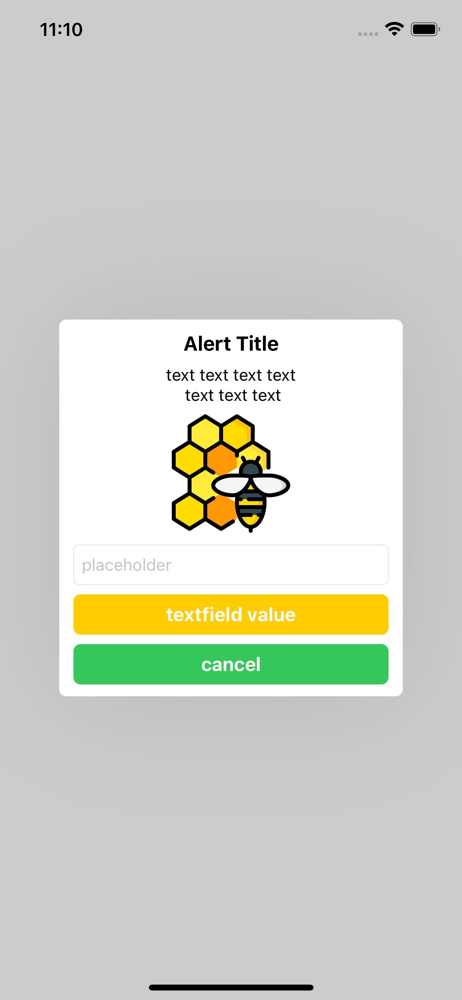
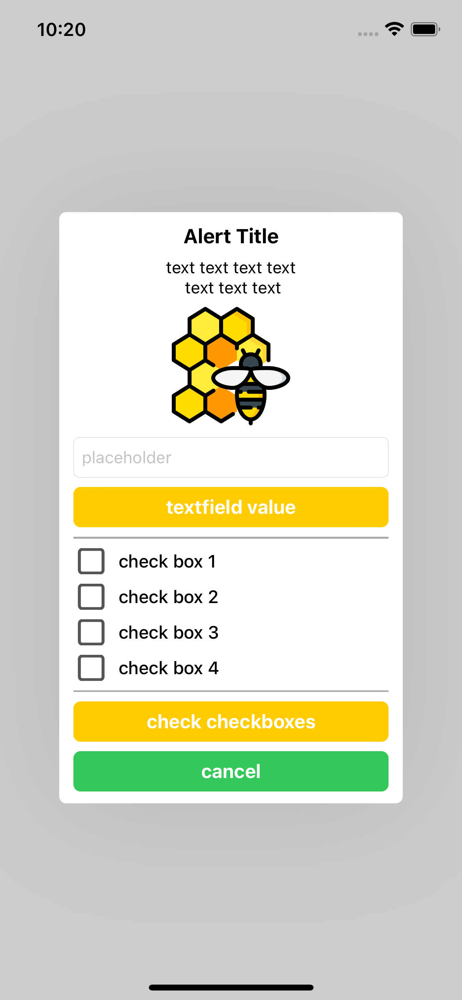

# SCAlertController

[](https://travis-ci.org/ohzw/SCAlertController)
[](https://cocoapods.org/pods/SCAlertController)
[](https://cocoapods.org/pods/SCAlertController)
[](https://cocoapods.org/pods/SCAlertController)




## Support
- [x] Title
- [x] Message (TextView)
- [x] Image
- [x] TextField
- [x] Button Action
- [x] CheckBox
- [x] Divider

automatically switch text color by brightness of window.


## Installation

SCAlertController is available through [CocoaPods](https://cocoapods.org). To install
it, simply add the following line to your Podfile:

```ruby
pod 'SCAlertController'
```

## Example
```Swift
    let alert = SEAlertController(title: "Alert Title", message: "text text text text \n text text text")

    alert.addImageContent(UIImage(named: "apitherapy"), 100)

    let textField = UITextField()
    textField.placeholder = "placeholder"
    alert.addTextField(textField: textField)

    alert.addAction(action: SEAlertAction(title: "textfield value", type: .normal, action: {
        guard let fieldText = textField.text else { return }
        print(fieldText)
    }))

    alert.addAction(action: SEAlertAction(title: "cancel", type: .cancel, action: {
        print("cancel")
    }))

    self.present(alert, animated: true)
```

```Swift 
    // AppDelegate
    SCAlertGlobalAppearance = SCAlertAppearance(
        windowColor: .white,
        backgroundDim: 0.2,
        normalActionColor: .systemYellow,
        cancelActionColor: .systemGreen
    )
```

## You can create Alert Template
```Swift
class CheckBoxAlert: SCAlertController {
    
    convenience init(title: String) {
        self.init()
        setupAlert()

        setTitle(title: title)
    }
    
    override func viewWillAppear(_ animated: Bool) {
        super.viewWillAppear(animated)
        
        addCheckBox(title: "check box 1")
        addCheckBox(title: "check box 2")
        addCheckBox(title: "check box 3")
        addCheckBox(title: "check box 4")
        addDivider(color: .lightGray, 1)
        addAction(action: SCAlertAction(title: "checkBoxes", type: .normal, action: checkBoxes))
    }
    
    private func checkBoxes() {
        for check in self.checkBoxes {
            let index = checkBoxes.firstIndex(of: check)! + 1

            if check.isChecked {
                print("box\(index) is checked")
            } else {
                print("box\(index) is not checked")
            }
        }
    }
}
```
```Swift
let errorAlert = CheckBoxAlert(title: "select checkbox!")
present(alert, animated: true)
```