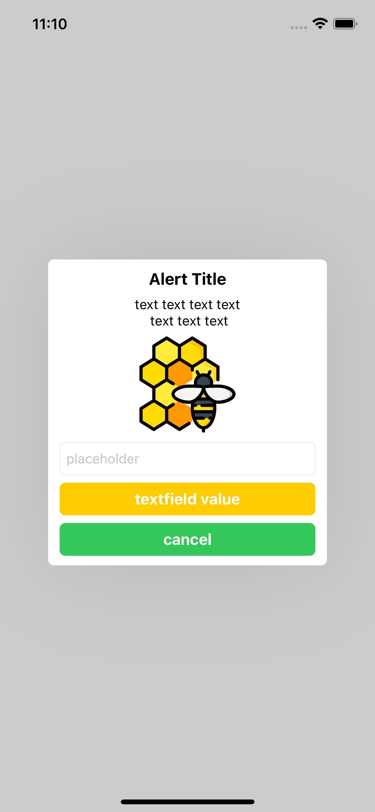

# SCAlertController

[](https://travis-ci.org/ohzw/SCAlertController)
[](https://cocoapods.org/pods/SCAlertController)
[](https://cocoapods.org/pods/SCAlertController)
[](https://cocoapods.org/pods/SCAlertController)



## Support
- [x] Title
- [x] Message (TextView)
- [x] Image
- [x] TextField
- [x] Button Action

automatically switch text color by brightness of window.


## Installation

SCAlertController is available through [CocoaPods](https://cocoapods.org). To install
it, simply add the following line to your Podfile:

```ruby
pod 'SCAlertController'
```

## Example
```Swift
    let alert = SEAlertController(title: "Alert Title", message: "text text text text \n text text text")

    alert.addImageContent(UIImage(named: "apitherapy"), 100)

    let textField = UITextField()
    textField.placeholder = "placeholder"
    alert.addTextField(textField: textField)

    alert.addAction(action: SEAlertAction(title: "textfield value", type: .normal, action: {
        guard let fieldText = textField.text else { return }
        print(fieldText)
    }))

    alert.addAction(action: SEAlertAction(title: "cancel", type: .cancel, action: {
        print("cancel")
    }))

    self.present(alert, animated: true)
```

```Swift 
    // AppDelegate
    SCAlertGlobalAppearance = SCAlertAppearance(
        windowColor: .white,
        backgroundDim: 0.2,
        normalActionColor: .systemYellow,
        cancelActionColor: .systemGreen
    )
```